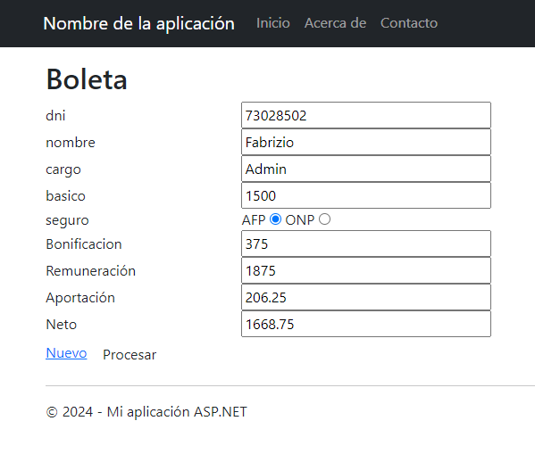

# Boleta de Haberes
Esta es una aplicación web MVC desarrollada en C# utilizando Visual Studio 2022, que permite calcular los haberes de un empleado. La aplicación gestiona información como el DNI, nombre, cargo, sueldo básico y tipo de seguro, y realiza cálculos automáticos de bonificaciones, remuneración, aportaciones y neto a recibir.

## Imagen del Proyecto

## Características

- **Gestión de Empleados:** Permite ingresar información básica de un empleado, incluyendo DNI, nombre, cargo y sueldo básico.
- **Cálculos Automáticos:**
  - **Bonificación:** Calcula el 25% del sueldo básico.
  - **Remuneración:** Suma el sueldo básico y la bonificación.
  - **Aportación:** Calcula el monto de aportación dependiendo del tipo de seguro (AFP u ONP).
  - **Neto:** Calcula el monto neto a recibir después de las deducciones.

## Tecnologías Utilizadas
- Lenguaje de Programación: C#
- Framework: ASP.NET MVC
- Entorno de Desarrollo: Visual Studio 2022
- Paradigma: Programación Orientada a Objetos (POO)

## Uso
- Navega a la página de boleta de haberes.
- Ingresa la información requerida del empleado (DNI, nombre, cargo, sueldo básico y tipo de seguro).
- Presiona el botón "Procesar" para calcular y mostrar la bonificación, remuneración total, aportación y neto a recibir.
